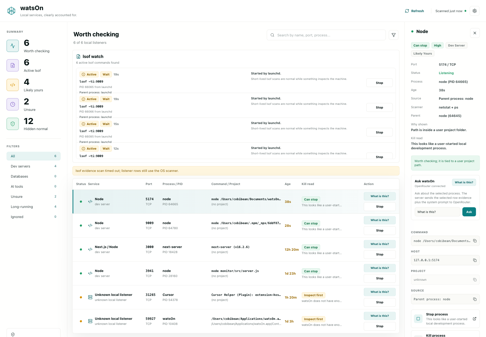

# watsOn

<p align="center">
  
</p>

<p align="center">
  <strong>Find the dev servers, ports, and background services still running on your machine.</strong>
</p>

<p align="center">
  watsOn scans local listening ports, explains what each process probably is, shows the evidence behind that guess, and helps you decide what is safe to stop.
</p>

<p align="center">
  <a href="https://github.com/cobibean/watsOn/stargazers"></a>
  <a href="https://github.com/cobibean/watsOn/blob/master/LICENSE"></a>
  
  
</p>



## Why watsOn exists

Modern local development leaves things behind.

A coding agent starts Vite on one port. You test a Next.js app on another. Prisma Studio, Storybook, Redis, ngrok, browser automation, or an old diagnostic command keeps running in the background. A few hours later, your machine has a tiny haunted network map and you have no idea what is safe to stop.

watsOn is a local dashboard for that moment.

It treats listening ports as evidence, not guilt. It shows the process, command, parent process, project path, scanner source, and stop guidance so you can make the call without spelunking through `lsof`, `netstat`, `ss`, `ps`, and PowerShell by hand.

## Highlights

- **Local listener discovery**: finds listening TCP ports on macOS, Linux, and Windows.
- **Useful classification**: separates likely dev work from normal OS/app background services.
- **Evidence-first UI**: explains every classification with command text, known ports, parent process, project path, or `lsof` evidence.
- **Stop guidance**: marks processes as safe to stop, inspect first, or do not stop.
- **Stale diagnostic detection**: spots `lsof` scans and other commands that should have exited.
- **Local ignore list**: hide services you expect to keep running.
- **Optional AI helper**: ask an OpenRouter model about a selected listener using your own API key.
- **No telemetry**: no account, hosted backend, daemon, sync service, or analytics.
- **Personal Mac app**: package an unsigned Electron app for your own machine.

## What it is not

watsOn is intentionally cautious.

It is not a security scanner. It is not a process manager for production machines. It does not claim every unknown listener is suspicious. It does not phone home. It does not kill system processes for you. It is meant to make your local development environment easier to understand.

## Quick Start

Requirements:

- Node.js
- npm

Clone and install:

```bash
git clone https://github.com/cobibean/watsOn.git
cd watsOn
npm install
```

Run the local API and Vite UI:

```bash
npm run dev
```

Open:

```text
http://127.0.0.1:5173
```

For a production-style local run:

```bash
npm run build
npm start
```

Open:

```text
http://127.0.0.1:4141
```

## Optional OpenRouter Assistant

watsOn can ask an OpenRouter chat model about a selected listener.

Copy the example env file:

```bash
cp .env.example .env.local
```

Set your key:

```bash
OPENROUTER_API_KEY=your_key_here
OPENROUTER_MODEL=openrouter/auto
```

Restart `npm run dev`.

The browser never receives the key. The local server reads it from `.env.local` or `.env`, then sends selected service evidence to OpenRouter only when you ask the assistant a question.

## Personal macOS App

watsOn can be packaged as an unsigned personal Mac app. This does not require an Apple Developer ID.

```bash
npm run mac:pack
open release/mac-arm64/watsOn.app
```

For a quick local app launch without creating a release bundle:

```bash
npm run mac:open
```

The packaged app starts its own private localhost server on a random port and loads the built UI in an Electron window. It is intentionally unsigned for now.

If macOS blocks a downloaded copy later, right-click the app and choose **Open**, or remove quarantine for your local copy:

```bash
xattr -dr com.apple.quarantine release/mac-arm64/watsOn.app
```

## How It Works

watsOn combines native OS tools with process inspection:

| Platform | Scanner |
| --- | --- |
| macOS | `netstat`, timeout-protected `lsof`, and `ps` |
| Linux | `ss`, `netstat`, timeout-protected `lsof`, and `ps` |
| Windows | `netstat` and PowerShell process details |

Each listener is enriched with process details and classified into one of three buckets:

| Bucket | Meaning |
| --- | --- |
| `Likely yours` | Project commands, package runners, dev servers, databases, AI tools, tunnels, or ports strongly associated with developer workflows. |
| `Normal` | OS services, app helpers, browser helpers, updaters, VPN agents, and vendor background services. These are hidden from the main list by default. |
| `Unsure` | Local listeners with too little evidence to judge. |

## Development

Useful checks:

```bash
npm run lint
npm run build
```

The app is built with:

- React
- TypeScript
- Vite
- Express
- Electron
- Lucide React

## Contributing

Issues and pull requests are welcome.

Good first areas:

- Add better classification rules for common local tools.
- Improve Windows and Linux process evidence.
- Add tests around scanner parsing and stop safety.
- Polish the Electron packaging flow.
- Improve accessibility and keyboard navigation.

Please keep changes conservative around process stopping. The project should prefer useful caution over false confidence.

## Security and privacy

- watsOn binds to localhost.
- There is no telemetry.
- There is no hosted backend.
- There is no account system.
- API keys belong in `.env.local` or `.env`, both of which are ignored by git.
- The optional OpenRouter assistant is only called when you ask it a question.
- Stop actions are blocked for protected/system processes and for watsOn's own API process.

If you find a security issue, please open a private report through GitHub Security Advisories if available, or contact the maintainer directly.

## Maintainer

Built by [@cobi_bean](https://twitter.com/cobi_bean).

If watsOn is useful or interesting, a star helps more people find it.

## License

MIT. See [LICENSE](LICENSE).
